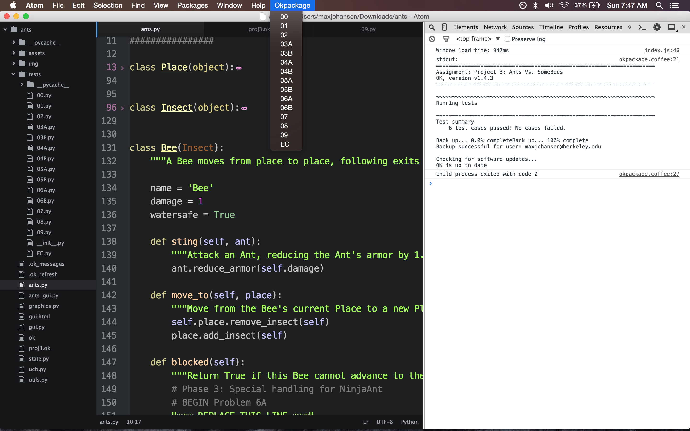

# okpackage package

Run [ok.py](https://github.com/Cal-CS-61A-Staff/ok) tests from Atom editor

Instructions
============
```
git clone https://github.com/macsj200/okpackage
cd okpackage
apm install
apm link .
```

TODO
====
* Fix path config for python binary
* Style UI


